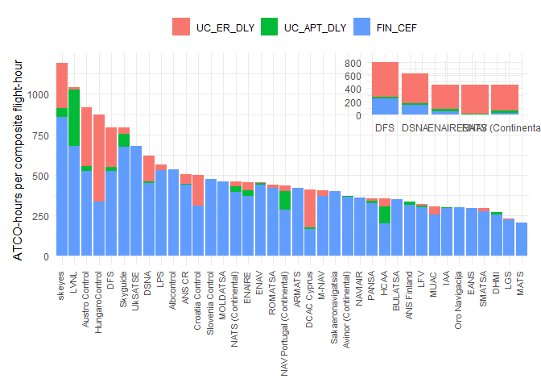
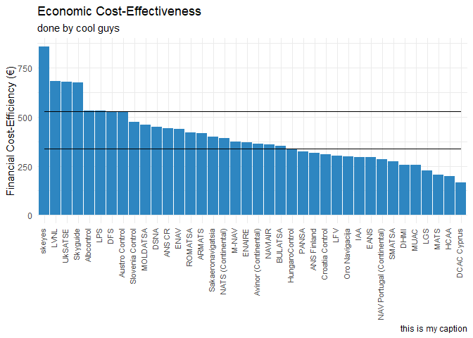

JC\_Data\_plot
================

## Economic cost effectiveness

Some text

``` r
suppressWarnings(suppressMessages(library("dplyr", quietly = T)))
suppressWarnings(suppressMessages(library("readxl", quietly = T)))
suppressWarnings(suppressMessages(library("tidyverse", quietly = T)))
suppressWarnings(suppressMessages(library("ggplot2", quietly = T)))
## to tidy up our table
suppressWarnings(suppressMessages(library("tidyr", quietly = T)))
## combining plots
suppressWarnings(suppressMessages(library("patchwork", quietly = T)))
##suppressMessages(library(dplyr))

# Read Excel file
ds <- read_xlsx(path = "C:/LocalFiles/RProjects/Test/data/JCH_data.xlsx", sheet="Sheet2")
names(ds)
```

    ## [1] "ANSPs"                                    
    ## [2] "Financial gate-to-gate cost-effectiveness"
    ## [3] "Unit cost of en-route ATFM delays"        
    ## [4] "Unit cost of airport ATFM delays"         
    ## [5] "Economic cost-effectiveness"              
    ## [6] "Economic cost-effectiveness (1/4)"        
    ## [7] "Economic cost-effectiveness (3/4))"

``` r
# check if there are na values somewhere
colSums(is.na(ds))
```

    ##                                     ANSPs 
    ##                                         1 
    ## Financial gate-to-gate cost-effectiveness 
    ##                                         1 
    ##         Unit cost of en-route ATFM delays 
    ##                                         1 
    ##          Unit cost of airport ATFM delays 
    ##                                         1 
    ##               Economic cost-effectiveness 
    ##                                         1 
    ##         Economic cost-effectiveness (1/4) 
    ##                                         2 
    ##        Economic cost-effectiveness (3/4)) 
    ##                                         2

Another chunk

``` r
#Changing the names of columns
names(ds)[1] <- "ANSP_NAME"
names(ds)[2] <- "FIN_CEF"
names(ds)[3] <- "UC_ER_DLY"
names(ds)[4] <- "UC_APT_DLY"
names(ds)[5] <- "CEF"
names(ds)[6] <- "CEF1_4"
names(ds)[7] <- "CEF3_4"

#Select a range of rows
#ds[1:38,] -> ds 
ds <- ds %>% 
  filter(!is.na(ANSP_NAME), ANSP_NAME != "Total European System")

#Coerce into a facto... it wasn´t necessary at the end
ds %>% mutate(ANSP2 = as.factor(ANSP_NAME))
```

    ## # A tibble: 38 x 8
    ##    ANSP_NAME      FIN_CEF UC_ER_DLY UC_APT_DLY   CEF CEF1_4 CEF3_4 ANSP2        
    ##    <chr>            <dbl>     <dbl>      <dbl> <dbl>  <dbl>  <dbl> <fct>        
    ##  1 skeyes            856.   279.        54.8   1190.   340.   526. skeyes       
    ##  2 LVNL              681.    13.3      347.    1042.   340.   526. LVNL         
    ##  3 Austro Control    525.   364.        32.0    920.   340.   526. Austro Contr~
    ##  4 HungaroControl    336.   535.         0.592  871.   340.   526. HungaroContr~
    ##  5 DFS               527.   247.        20.9    795.   340.   526. DFS          
    ##  6 Skyguide          675.    38.4       79.2    793.   340.   526. Skyguide     
    ##  7 UkSATSE           679.     0          1.76   681.   340.   526. UkSATSE      
    ##  8 DSNA              448.   156.        14.3    618.   340.   526. DSNA         
    ##  9 LPS               530.    34.6        0      564.   340.   526. LPS          
    ## 10 Albcontrol        532.     0.128      0      533.   340.   526. Albcontrol   
    ## # ... with 28 more rows

``` r
#Tidy data

tmp <- ds %>% select (1:4) %>% 
  pivot_longer(cols = c("FIN_CEF","UC_ER_DLY","UC_APT_DLY"), names_to = "TYPE", values_to ="value") 

# Change "Continental"  by "Cont" 
tmp <- tmp %>% mutate(across(ANSP_NAME,~str_replace_all(ANSP_NAME,"Continental","Cont.")))
```

Working now with tidy data

``` r
# We plot now the tidy data
# But first we create a table with the labels for the graph... I tried first with an additional column but better with a separate table
  # tmp <- tmp %>% group_by(ANSP_NAME) %>% mutate(graph_label = sum(value))
mylabels <- tmp %>% group_by(ANSP_NAME) %>% summarise(graph_label=sum(value))
# turns out the sorting below is not needed
  # mylabels <- mylabels %>% arrange(-graph_label)
# I need the quartiles too for the lines
mylabels <- mylabels %>% mutate(q25=unname(quantile(graph_label, probs=0.25)), q75=unname(quantile(graph_label, probs=0.75)))

vis1 <- tmp %>%
  ggplot()+

# note the refactoring of the TYPE to change the ordering in the stacked bar
  aes(x=reorder(ANSP_NAME, -value), y = value, fill = factor(TYPE,levels=c("UC_ER_DLY", "UC_APT_DLY", "FIN_CEF")))+
  geom_col()+
  
# Add labels to the bars
  geom_text(data=mylabels, size=3, aes(x=ANSP_NAME, y=graph_label, label = round(graph_label, digits=0), angle = 90, hjust=-0.2), inherit.aes = FALSE)+

# resetting the y axis limit so the label is not out of range
  coord_cartesian(ylim=c(0,max(mylabels$graph_label)+200))+
  
# adding the quartiles
   geom_line(data=mylabels, aes(x=ANSP_NAME, y=q25, group="OSCAR"), linetype = "dashed", color="#333399", size=1, alpha = 0.5, inherit.aes = FALSE)+
   geom_line(data=mylabels, aes(x=ANSP_NAME, y=q75, group="OSCAR"), linetype = "dashed", color="#333399", size=1, alpha = 0.5, inherit.aes = FALSE)+
  
# This line changes the colour of the bars  and the labels of the legend
  scale_fill_manual(values = c("#eee600", "#ff0000", "#9999ff"), labels = c("Unit cost of en-route ATFM delays", "Unit cost of aiport ATFM delays", "Financial G2G cost-effectiveness"))+
   ##geom_text(size=3, aes(label = round(Total, digits = 2)), angle = 90, vjust = +0.5, hjust = +1)+
  
  theme_minimal()+
  theme(axis.text.x = element_text(size=8, angle=90, hjust=1, vjust=0.2))+

  # Customize legend
  theme(legend.position="top", legend.title = element_blank(), legend.key.size = unit(0.3,"cm"))+
  theme(panel.grid.major = element_blank(), panel.grid.minor = element_blank())+
  labs(x=NULL, y="€ per composite flight-hour")

## vis1
##vis1 + vis1
##vis1 / vis1
```

Creating the inset graph

``` r
largest5 <- tmp %>% filter(ANSP_NAME %in% c("DFS", "DSNA", "ENAV", "ENAIRE", "NATS (Cont.)"))
vis2 <- largest5 %>%
  ggplot()+
  aes(x=ANSP_NAME, y = value, fill = factor(TYPE,levels=c("UC_ER_DLY", "UC_APT_DLY", "FIN_CEF")))+
  geom_col()+
  scale_fill_manual(values = c("#eee600", "#ff0000", "#9999ff"))+
  theme_minimal()+
  theme(axis.text.x = element_text(size=7, angle=90, hjust=1, vjust=0.2))+
  theme(legend.position="none", panel.grid.major = element_blank(), panel.grid.minor = element_blank())+
  labs(x=NULL, y=NULL)

vis1 + inset_element(vis2, left = 0.6, bottom = 0.3, right = 1, top = 1)
```

<!-- -->

This was the first attempt, kept here in case we need it

``` r
# plot graph
ds %>%
  ggplot()+
  aes (x=reorder(ANSP_NAME,-FIN_CEF), y=FIN_CEF)+
  geom_col(fill="#2e86c1")+
  geom_line(aes(x=ANSP_NAME, y=CEF1_4, group="OSCAR"))+
  geom_line(aes(x=ANSP_NAME, y=CEF3_4, group="JC")) +
  theme_minimal()+
   theme(axis.text.x=element_text(size=8, angle=90,hjust=1,vjust=0.2))+
  labs(title="Economic Cost-Effectiveness", subtitle="done by cool guys", caption="this is my caption", x=NULL, y="Financial Cost-Efficiency (€)")
```

<!-- -->
